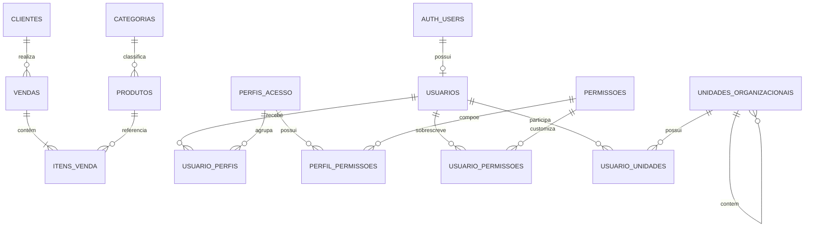

---
tags:
  - banco
  - supabase
  - relações
status: atual
ultima_revisao: 2026-07-28
---

# Banco de dados Supabase

Projeto: `dzwjdmmijqgudfldzmfl`.

## Tabelas

### `categorias`

| Coluna       | Tipo        | Regra               |
| ------------ | ----------- | ------------------- |
| `id`         | bigint      | PK, auto incremento |
| `nome`       | text        | obrigatório, único  |
| `created_at` | timestamptz | padrão `now()`      |

### `produtos`

| Coluna | Tipo | Regra |
|---|---|---|
| `id` | bigint | PK, auto incremento |
| `nome` | text | obrigatório |
| `descricao` | text | opcional |
| `preco` | numeric(10,2) | obrigatório |
| `estoque` | integer | obrigatório, padrão 0 |
| `categoria_id` | bigint | FK opcional para `categorias.id` |
| `imagem_url` | text | opcional |
| `created_at` | timestamptz | padrão `now()` |

Exclusão da categoria define `categoria_id` como nulo.

### `clientes`

| Coluna | Tipo | Regra |
|---|---|---|
| `id` | bigint | PK, auto incremento |
| `nome` | text | obrigatório |
| `telefone` | text | opcional |
| `email` | text | opcional |
| `endereco` | text | opcional |
| `created_at` | timestamptz | padrão `now()` |

### `vendas`

| Coluna | Tipo | Regra |
|---|---|---|
| `id` | bigint | PK, auto incremento |
| `cliente_id` | bigint | FK opcional para `clientes.id` |
| `total` | numeric(10,2) | obrigatório |
| `forma_pagamento` | text | opcional |
| `status` | text | padrão `finalizada` |
| `created_at` | timestamptz | padrão `now()` |

Exclusão do cliente define `cliente_id` como nulo.

### `itens_venda`

| Coluna | Tipo | Regra |
|---|---|---|
| `id` | bigint | PK, auto incremento |
| `venda_id` | bigint | FK obrigatória para `vendas.id` |
| `produto_id` | bigint | FK obrigatória para `produtos.id` |
| `quantidade` | integer | obrigatório |
| `preco_unitario` | numeric(10,2) | obrigatório |

Excluir uma venda exclui seus itens em cascata. Excluir um produto também exclui os itens históricos relacionados; isso é um risco registrado em [[08 - Limitações e débitos técnicos]].

### `usuarios`

| Coluna | Tipo | Regra |
|---|---|---|
| `id` | uuid | PK e FK para `auth.users.id` |
| `email` | text | obrigatório, único |
| `nome` | text | opcional |
| `cargo` | text | padrão `Vendedor` |
| `perfil_acesso` | text | padrão `usuario` |
| `avatar_url` | text | opcional |
| `ativo` | boolean | padrão verdadeiro; usuário inativo não recebe permissões |
| `created_at` | timestamptz | padrão `now()` |

### Administração e permissões

- `perfis_acesso`: perfis customizáveis; Admin e Vendedor são perfis do sistema.
- `permissoes`: catálogo de módulo, ação e código utilizado pelo frontend/RLS.
- `perfil_permissoes`: relação N:N entre perfis e permissões.
- `usuario_perfis`: relação N:N entre usuários e perfis, com um perfil principal.
- `usuario_permissoes`: exceções individuais; `permitido` pode liberar ou negar.
- `unidades_organizacionais`: árvore hierárquica por `parent_id`.
- `usuario_unidades`: membros e responsáveis das unidades.

## Relações

## Função

`diminuir_estoque(pid bigint, qtd integer)` atualiza `produtos.estoque = estoque - qtd`.

- Quantidade positiva baixa estoque.
- Quantidade negativa devolve estoque.
- Atualmente não impede estoque negativo.

## RLS

RLS está habilitado nas tabelas de negócio e administração. As políticas públicas iniciais foram substituídas por `has_permission(codigo)`. Usuários inativos não recebem acesso e o administrador possui salvaguarda de acesso total.

Funções administrativas:

- `is_admin()`: confirma o perfil administrativo do usuário autenticado.
- `has_permission(codigo)`: calcula permissão efetiva com prioridade para exceção individual.
- `get_my_permissions()`: entrega o conjunto efetivo ao frontend.
- `salvar_permissoes_perfil(...)`: atualiza permissões de um perfil em transação.
- `salvar_acesso_usuario(...)`: atualiza perfis e exceções em transação.

## Migrações

- Migração inicial: `supabase/migrations/001_schema.sql`.
- Toda mudança estrutural futura deve criar um novo arquivo numerado; não editar silenciosamente uma migração já aplicada.
- DDL deve ser aplicado como migração e testado antes da produção.
- Seeds não devem depender de IDs fixos quando houver risco de dados preexistentes.

## Registros — fase 1 aplicada

A migração `006_registros_fase1.sql` adicionou somente tabelas novas:

- `empresas`;
- `filiais`, com empresa opcional;
- `fornecedores`, com empresa e filial opcionais;
- `formas_pagamento`, com empresa opcional;
- `tabelas_preco`, com empresa e filial opcionais;
- `tabela_preco_itens`, relacionando tabela e produto sem alterar `produtos`.

Relações:

- `filiais.empresa_id` → `empresas.id`, opcional e `ON DELETE SET NULL`;
- `fornecedores.empresa_id` e `fornecedores.filial_id`, opcionais e `ON DELETE SET NULL`;
- `formas_pagamento.empresa_id`, opcional e `ON DELETE SET NULL`;
- `tabelas_preco.empresa_id` e `tabelas_preco.filial_id`, opcionais e `ON DELETE SET NULL`;
- `tabela_preco_itens.tabela_preco_id`, obrigatório e `ON DELETE CASCADE`;
- `tabela_preco_itens.produto_id`, obrigatório e `ON DELETE RESTRICT`.

Todas possuem RLS por `registros.visualizar`, `registros.criar`, `registros.editar` e `registros.excluir`. Nenhuma coluna das tabelas anteriores foi removida ou modificada. O rollback está em `supabase/rollbacks/006_registros_fase1_rollback.sql` e remove os dados novos, portanto exige confirmação e backup.
